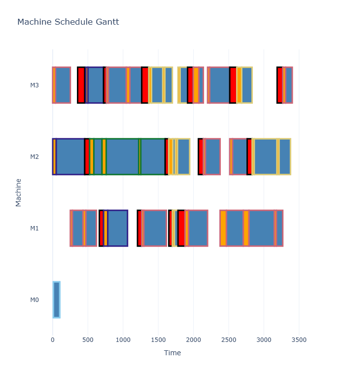

## Optimization Scheduler

実務志向の生産スケジューリングシステム（OR-Tools CP-SAT）

## 背景

実際の製造現場では、計画変更・突発停止・設備制約などが頻繁に発生します。
理論的な最適化モデルのみでは運用が難しいため、
本システムでは **実行可能性と安定性を最優先** とした設計を行っています。

## 目的

納期、稼働率、段取り効率といった生産性指標を考慮しながら、
現実の制約条件の下で実行可能な計画を生成する。

## 最適化モデル概要

本システムはジョブショップスケジューリング(JSSP)をベースとし、
実運用制約（材料切替・固定作業・非稼働時間）を拡張した設計をしています。

本リポジトリでは、設備非稼働はロックジョブによるリソース占有として表現しています。

実運用環境では設備・人カレンダー制約(リソースカレンダー)として明示的に管理しており
計画的残業・休暇・早番/遅番など、運用条件に応じてモデル表現を切り替え可能な設計としています。

計算効率や再計画時の扱いやすさを考慮し、用途に応じて制約の表現方法を切り替えています。

### Route Selection（加工ルート選択）

各ジョブは複数の加工ルート候補を持ち、
ソルバーは制約条件および目的関数に基づき
実行可能なルートを自動選択します。

ルート選択は Optional Interval を用いて表現しており、
Exactly-one 制約により各工程で単一ルートのみが有効化されます。

これにより本モデルは従来の Job Shop Scheduling Problem を拡張した
Flexible Job Shop Scheduling Problem (FJSP) として定式化されています。

**実運用環境では受注投入や設備状態変更を契機として
  再スケジューリングを実行するイベント駆動型運用を採用しています。
  本デモではローリングホライゾン構造の理解を目的とし、
  イベント制御部分は簡略化しています。

### 使用技術
- Python
- Google OR-Tools (CP-SAT)
- Pandas
- Plotly

## 特徴
- 実運用を前提とした設計
- 材料切替(清掃)を最適化対象として扱う
- 計画の安定性を重視したローリング再計画
- 非稼働時間をデータベース管理し動的変更に対応
- 現場負荷を考慮したスケジューリング

### 制約条件
- 機械排他制約（NoOverlap）
- 複数ルート内から１ルートを選択
- 工程順序制約
- 材料変更時の清掃発生
- 固定ジョブ（ロック）保持
- ダミージョブによる停止区間表現
- Setup作業のみworker non-overlap
  
## 最適化方針
- Makespan（全体完了時間）
- ジョブ間切替コスト発生回数（清掃回数) *ジョブtoジョブ 材料変更による清掃作業

複雑な指標を直接目的関数に含めるのではなく、モデルの安定性と実行可能性を優先しています。
その他の指標（納期、稼働率など）は評価指標として分析します。

実運用における計算時間制約を考慮し、厳密最適解よりも高品質な実行可能解の生成を重視しています。

## 主な機能

### ■ ローリングホライゾンスケジューリング
既存計画を保持しながら再計画を実施。

### ■ 材料変更（清掃）最適化
ジョブ間の材料変更による清掃作業を削減。

### ■ 固定作業保持（ロック機能）
確定済み作業を変更せず再計画可能。

### ■ What-ifシミュレーション
条件変更時の影響分析。

## 可視化

ソルバー出力を Plotly でガントチャート表示。

- setup / process の色分離
- ダミージョブ強調表示
- 材料別の外枠カラー表示
- Worker / Priority を hover 表示

材料切替の連続性を視覚的に確認可能。

## KPI出力

- Makespan
- 清掃（ダミー）時間合計
- 総加工時間

## 設計思想

- 現実制約を忠実に反映
- 安定性を重視
- 例外発生を前提とした構造
- 人の判断と最適化の協調

最適化を単発計算ではなく、
運用プロセスの一部として設計しています。

#クイックスタート
### 1. 依存パッケージのインストール
pip install -r requirements.txt

### 2. スケジューラの実行
python main.py

JobMakerクラスはパラメータ駆動型で設計されており、
多様な条件下でのスケジューリング挙動を再現・検証できます。
本プロジェクトに関するご質問は GitHub Issue より受け付けています。

本プロジェクトでは生成AI（LLM）を思考補助ツールとして活用し、
現場制約の構造化・数理モデリング設計・アルゴリズム検討の
壁打ちパートナーとして利用しています。
